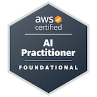

# 👋 Hello, I'm Matheus Marques!

## ☁️ Cloud & Infrastructure

I'm an AWS Certified professional focused on **Cloud Computing, Infrastructure, CloudOps, Linux, Monitoring, Troubleshooting, and Automation**.

After building a strong background in technology, I'm now fully focused on growing my career in **Cloud Infrastructure and Operations**, working with AWS services, Linux environments, infrastructure automation, observability, incident response, and resilient architectures.

My current goal is to work as a:

**CloudOps Analyst | Infrastructure Analyst | Cloud Support Analyst | Junior Cloud Engineer | NOC/SRE Entry-Level**

---

 
  
  
  

 

---

<h2 align="center">🏅 AWS Certifications</h2>

 

 
  

  &nbsp;&nbsp;&nbsp;

  

  &nbsp;&nbsp;&nbsp;

   

  &nbsp;&nbsp;&nbsp;

  

 

---

<h2 align="center">☁️ Cloud, Infrastructure & Operations</h2>

 

**AWS Cloud | CloudOps | Linux | Infrastructure | Monitoring | Terraform | Troubleshooting | Automation**

 

---

<h2 align="center">🛠️ Tools & Technologies</h2>

 

  
   
  

 

---

<h2 align="center">📚 Current Learning Path</h2>

 

**Cloud Operations | Linux Administration | AWS Networking | Monitoring | Observability | Terraform | SLA | Incident Response | Infrastructure Troubleshooting**

 

---

<h2 align="center">🎯 Career Focus</h2>

 

I'm currently focused on opportunities in **Cloud, Infrastructure, CloudOps, Support, Monitoring, and Operations**.

 

---

<h2 align="center">📊 GitHub Statistics</h2>

 

  

  

  

 